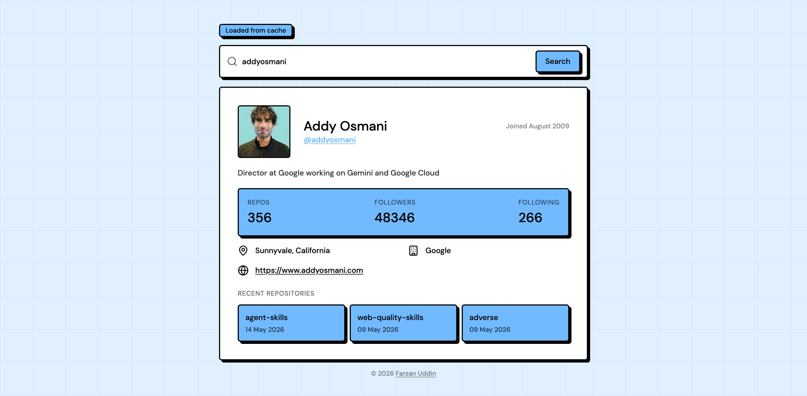

# Gitpulse

A GitHub profile search app built with Vite and React. Enter any GitHub username and instantly view
their profile details, stats, and recent repositories.

[https://farzanuddin.github.io/gitpulse](https://farzanuddin.github.io/gitpulse/)



## Objective

The goal of this project was to explore a few frontend tools and concepts I hadn't worked with
before: building a UI with a **neobrutalism**-inspired design system, making real requests to the
**GitHub API** and handling the data on the client side, and experiencing **Vite** as a build tool —
specifically its fast cold starts and instant HMR (Hot Module Replacement) during development.

## Features

- **Username search** — look up any GitHub user and fetch their public profile data
- **Autocomplete suggestions** — debounced live username suggestions with keyboard navigation while
  typing
- **Caching** — in-memory LRU cache with TTL minimizes redundant API calls; cached results are
  indicated via a badge
- **Error handling** — user-friendly error messages for network issues, rate limits, and missing
  users with a shake animation
- **Graceful crash recovery** — an Error Boundary catches runtime errors with a reload button

## Tech Stack

| Technology                                          | Version | Role                        |
| --------------------------------------------------- | :-----: | --------------------------- |
| [React](https://react.dev/)                         | ^18.2.0 | UI framework                |
| [Vite](https://vitejs.dev/)                         | ^5.4.21 | Build tool & dev server     |
| [Tailwind CSS v4](https://tailwindcss.com/)         | ^4.3.0  | Utility-first CSS framework |
| [PropTypes](https://github.com/facebook/prop-types) | ^15.8.1 | Runtime prop type checking  |
| [ESLint](https://eslint.org/)                       | ^8.45.0 | Code linting                |
| [Prettier](https://prettier.io/)                    | ^3.8.1  | Code formatter              |

## Autocomplete Limitation

Username autocomplete uses the GitHub Search API and may stop working after a few unauthenticated
requests due to rate limiting. To increase the limit, authenticate with a GitHub personal access
token by following the existing `.env.example` setup steps in the Getting Started section.

## Getting Started

1. Install dependencies:

   ```bash
   npm install
   ```

2. (Optional) Add a GitHub personal access token to raise the API rate limit from 60 to 5,000
   requests/hour:

   ```bash
   cp .env.example .env.local
   ```

   Open `.env.local` and replace `your_token_here` with a token from
   [github.com/settings/tokens](https://github.com/settings/tokens) — no scopes required. The app
   works without one.

3. Start the dev server:

   ```bash
   npm run dev
   ```
